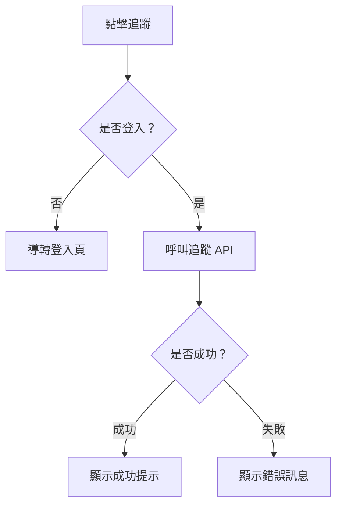

# 📄 Component SA 文件 - [元件名稱]

---

## 1. 元件基本資訊

| 欄位           | 說明                        |
|----------------|-----------------------------|
| 元件名稱       | `XXXComponent`              |
| 使用技術       | React / Vue / Svelte / ...  |
| 語言環境       | TypeScript / JavaScript     |
| 使用位置       | 例：首頁、搜尋頁、商品詳情頁 |
| 呼叫方式       | 由哪個父層引入 or 動態掛載    |

---

## 2. 元件用途說明

> 簡要說明這個元件的角色，例如：呈現商品資訊、觸發某個互動行為、作為容器承載其他子元件等。

---

## 3. 功能行為

| 功能名稱         | 行為描述（點擊/顯示/互動）              | 限制條件 / 判斷邏輯（如登入）        |
|------------------|-----------------------------------------|--------------------------------------|
| 點擊商品卡片     | 導轉至商品詳情頁                        | 無                                   |
| 點擊追蹤按鈕     | 判斷是否登入，登入則打 API 切換追蹤狀態  | 未登入導轉 `/login?redirect=xxx`    |
| 顯示價格          | 顯示原價、特價與折抵                     | 根據商品類型決定要不要顯示原價       |

---

## 4. 使用流程圖

> 若有互動行為或條件邏輯，建議使用 [Mermaid](https://mermaid.js.org/) 繪製流程圖，以下為插圖範例：



---

## 5. 元件資料結構

### Props / Inputs

```ts
    interface Props {
    id: string
    title: string
    imageUrl: string
    isFavorite: boolean
  }

```

---

