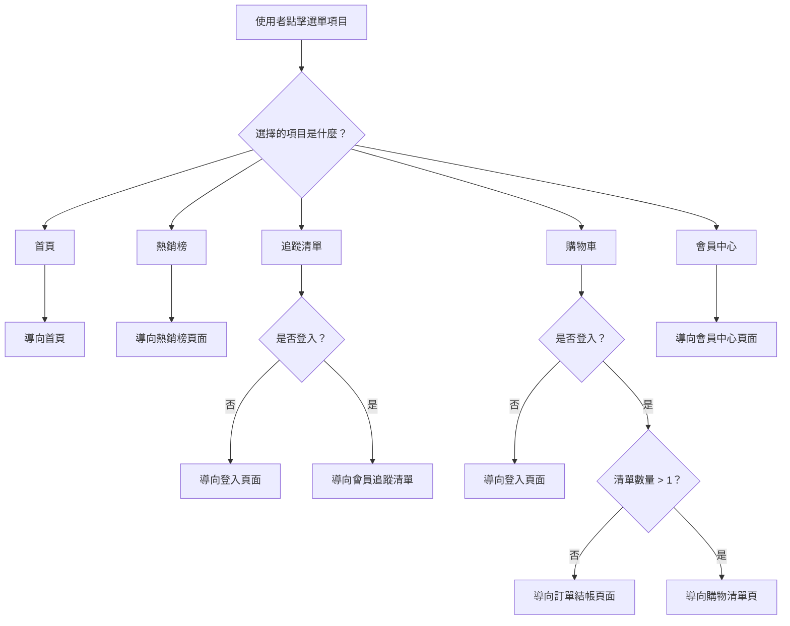

# 📄 TabMenu 元件 SA（系統分析）＋ SD（系統設計）文件

## 一、文件版本紀錄（Document Change Log）

| 版本   | 日期         | 作者       | 說明           |
| ---- | ---------- | -------- | ------------ |
| v1.0 | 2025-04-30 | Kuo Keri | 初版建立：SA + SD |

---

## 二、元件概述（Component Overview）

| 項目     | 說明                         |
| ------ | -------------------------- |
| 元件名稱   | `TabMenu`                  |
| 元件分類   | 導覽導向元件 / 共用元件              |
| 使用技術   | React + TypeScript         |
| 使用位置   | 頁面底部（Mobile 導覽列）           |
| 對外介面   | 無明確 props，使用固定選單配置         |
| 呼叫 API | 追蹤清單 API、購物車清單 API（尚未實作）   |
| 依賴資源   | router、登入判斷方法、購物車/追蹤清單狀態存取 |

---

## 三、功能說明（Feature Description）

| 功能編號  | 功能名稱   | 功能描述                  | 觸發條件  | 預期行為                              |
| ----- | ------ | --------------------- | ----- | --------------------------------- |
| F-001 | 導向首頁   | 點擊首頁 icon             | 使用者點擊 | 導向首頁頁面 `/home`                    |
| F-002 | 導向熱銷榜  | 點擊熱銷榜 icon            | 使用者點擊 | 導向 `/hot` 頁面                      |
| F-003 | 導向追蹤清單 | 點擊追蹤 icon，須判斷登入狀態     | 使用者點擊 | 未登入：導向登入頁；登入：導向 `/member/follow`  |
| F-004 | 導向購物車  | 點擊購物車 icon，須判斷登入與清單數量 | 使用者點擊 | 未登入：導向登入頁；登入後：依清單數量決定導向單一結帳或購物清單頁 |
| F-005 | 導向會員中心 | 點擊會員 icon             | 使用者點擊 | 導向 `/member/center`               |

---

## 四、元件流程圖（Mermaid 格式）



---

## 五、使用方式（Usage Example）

```tsx
<TabMenu />
```

---

## 六、元件樣式命名（BEM）

```html
<nav class="tab-menu">
  <div class="tab-menu__item">
    <span class="tab-menu__icon">🏠</span>
    <span class="tab-menu__label">首頁</span>
  </div>
  <!-- 依此類推 -->
</nav>
```

---

## 七、開發備註與 API 設計建議（待後端支援）

### 📌 API 尚未開發，建議格式如下：

- **追蹤清單 API**：`GET /api/user/following`
- **購物車清單 API**：`GET /api/user/carts`

回傳格式建議：

```ts
interface FollowingListResponse {
  items: Product[];
}

interface CartListResponse {
  carts: Cart[]; // 長度決定導向邏輯
}
```

---

## 八、維護紀錄（Component History）

| 日期         | 類型 | 說明                         | 版本   | 修改人      |
| ---------- | -- | -------------------------- | ---- | -------- |
| 2025-04-30 | 新增 | 初始建立 TabMenu 元件 SA + SD 文件 | v1.0 | Kuo Keri |

---

> 📌 建議後續如有 icon、文字、連結路徑變動，請同步更新此文件。

