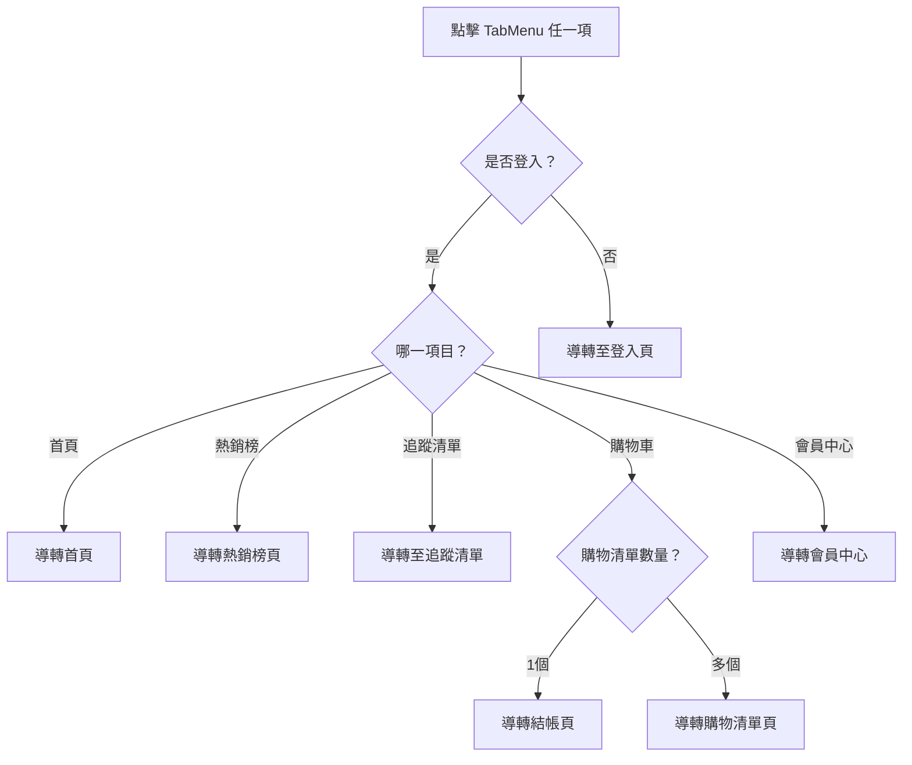

# 🧩 元件名稱：TabMenu

## 一、文件版本紀錄（Document Change Log）
| 版本 | 日期 | 作者 | 說明 |
|------|------|------|------|
| v1.0 | 2025-04-30 | Kuo Keri | 初版建立 |

---

## 二、元件概述（Component Overview）
| 項目 | 說明 |
|------|------|
| 元件名稱 | TabMenu |
| 元件類型 | 導覽功能元件 |
| 所屬平台 | 手機版網頁 |
| 使用技術 | React + TypeScript |
| 呼叫 API | ✔ 購物車資訊、✔ 追蹤清單資訊（API 尚未開發） |
| 使用位置 | `/src/components/TabMenu/` |
| 功能 | 提供底部選單導覽功能，依登入狀態進行導轉與資料取得 |

---

## 三、功能說明（Feature Description）
| 編號 | 功能項目 | 功能描述 | 導轉條件 / 行為 |
|------|----------|----------|----------------|
| F-001 | 首頁 | 點擊後導轉首頁 | 無條件 |
| F-002 | 熱銷榜 | 點擊後導轉熱銷榜頁面 | 無條件 |
| F-003 | 追蹤清單 | 檢查登入 → 未登入導轉登入頁 → 登入後導轉追蹤清單頁 | 需打 API 取得追蹤清單數據 |
| F-004 | 購物車 | 檢查登入 → 未登入導轉登入頁 → 登入後根據購物清單數量導轉 | 單一清單導轉結帳，多清單導轉清單頁，需打 API 取得清單數量 |
| F-005 | 會員中心 | 點擊後導轉會員中心頁 | 無條件 |

---

## 四、介面設計（Props Interface）
```ts
interface TabMenuProps {
  isLogin: boolean;
  cartListCount?: number; // 購物清單數量（API 後補）
  wishlistCount?: number; // 追蹤商品數量（API 後補）
  onNavigate: (route: string) => void; // 導轉用 callback
}
```

---

## 五、使用方式（Usage Example）
```tsx
<TabMenu
  isLogin={user.isLogin}
  cartListCount={userCartListCount}
  wishlistCount={userWishlistCount}
  onNavigate={(route) => router.push(route)}
/>
```

---

## 六、UI 行為邏輯（含流程圖）



---

## 七、樣式結構（BEM 命名範例）
```html
<nav class="tab-menu">
  <button class="tab-menu__item">首頁</button>
  <button class="tab-menu__item">熱銷榜</button>
  <button class="tab-menu__item">追蹤清單</button>
  <button class="tab-menu__item">購物車</button>
  <button class="tab-menu__item">會員中心</button>
</nav>
```

---

## 八、API 說明（尚未實作，預留設計）

### 📦 追蹤清單 API（預期設計）
- **GET** `/api/user/wishlist`
- **回傳資料**
```json
{
  "count": 6,
  "items": [...]
}
```

### 🛒 購物清單 API（預期設計）
- **GET** `/api/user/cartlists`
- **回傳資料**
```json
{
  "count": 2,
  "lists": [...]
}
```

---

## 九、擴充與備註（Developer Notes）
- [ ] 可支援 Tab 高亮狀態（根據目前頁面）
- [ ] 支援動畫或 transition 效果
- [ ] 若需支援 GA/事件追蹤，應於每個點擊動作中補埋點

---

## 十、維護紀錄（Component History）
| 日期 | 類型 | 說明 | 版本 | 修改人 |
|------|------|------|------|--------|
| 2025-04-30 | 新增 | 建立基本元件架構與導轉邏輯 | v1.0 | Kuo Keri |
